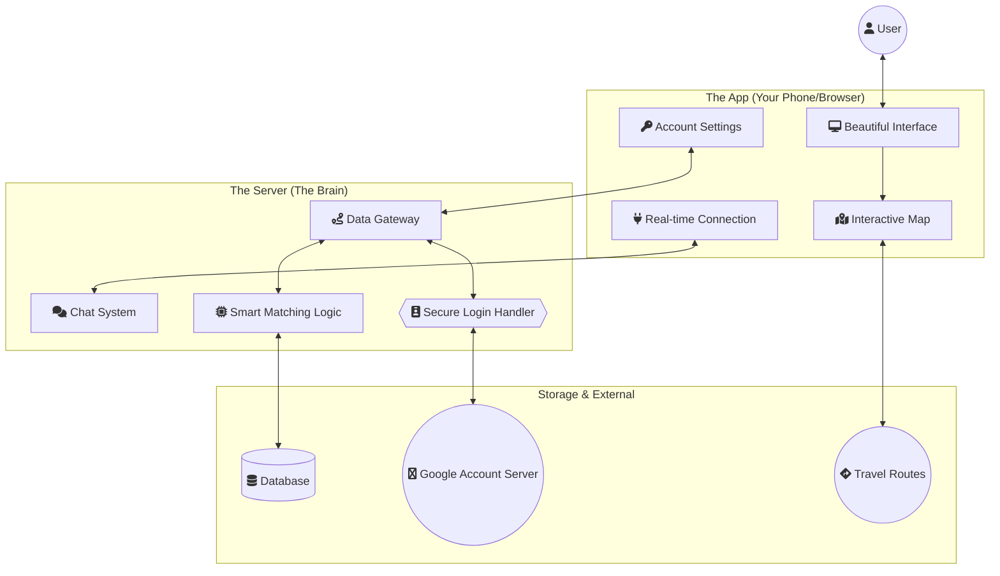
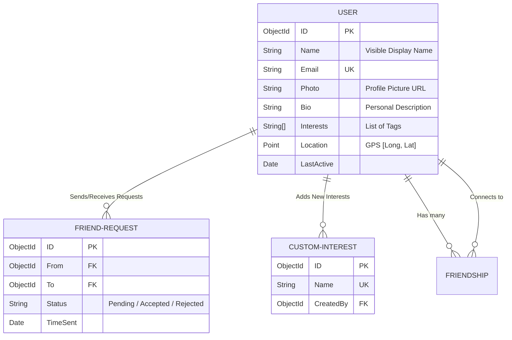
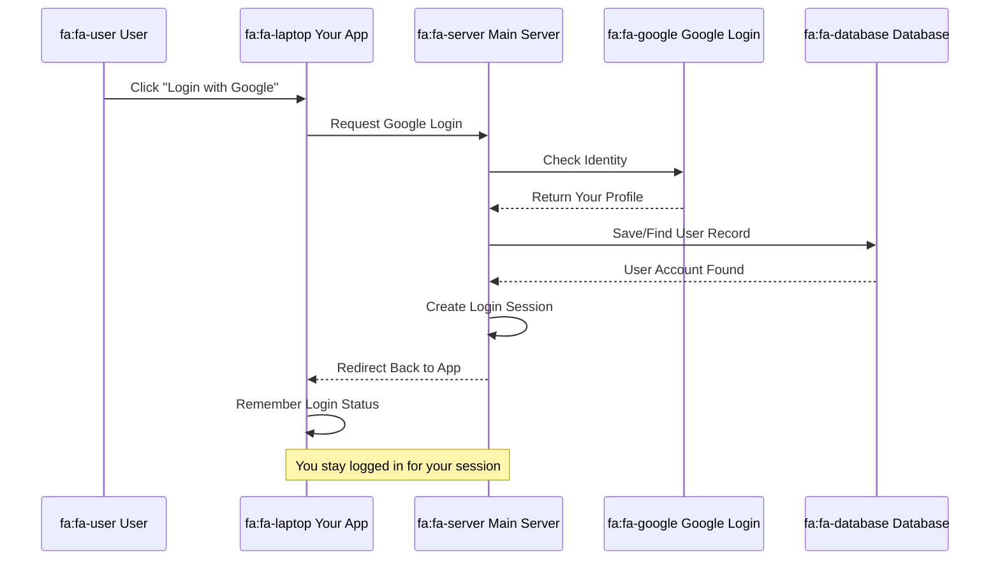
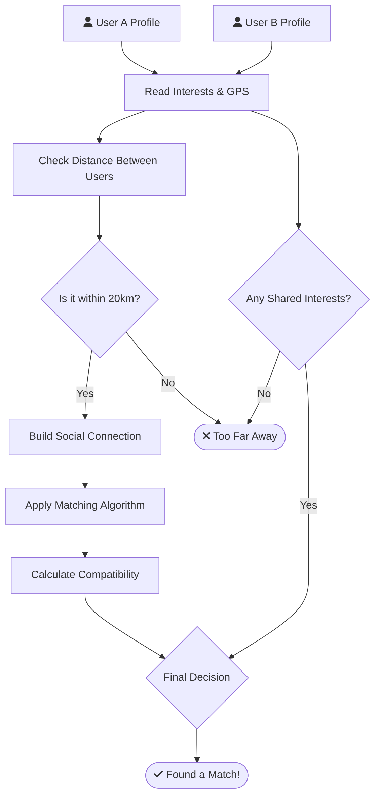
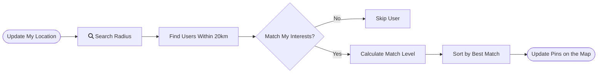
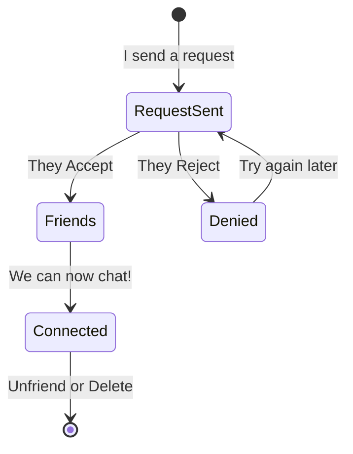
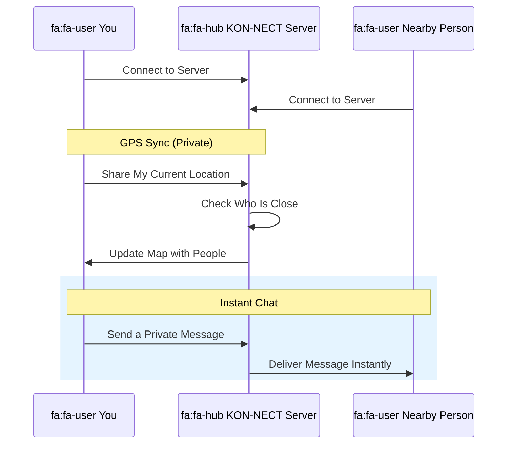
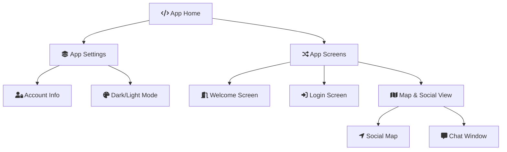

# KON-NECT: Project Architecture & System Diagrams

This document provides a comprehensive visual breakdown of how the KON-NECT application works, explaining the technology and logic for everyone.

---

## 🏗️ 1. How KON-NECT Works (System Map)
This map shows how the App, the Server, and external services like Google and Maps work together.

---

## 💾 2. Database: How Information is Stored
This shows how users, friends, and interests are connected together in our data storage.

---

## 🔐 3. How You Sign In (Secure Login)
This explains the step-by-step process of logging in securely using Google.

---

## 🧠 4. The Compatibility Brain (Smart Matching)
The logic that determines if two people are a good match for each other.

---

## 🔍 5. Finding People Near You
How the app scans the map to show people within walking distance.

---

## 🤝 6. Connecting with Others
The simple workflow of sending, accepting, or declining a friend request.

---

## 💬 7. Real-time Chat & Updates
How messages and location updates fly instantly between users without saving them forever (Privacy first).

---

## 🗺️ 8. Application Navigation Map
How the different screens and settings are organized inside the app.

