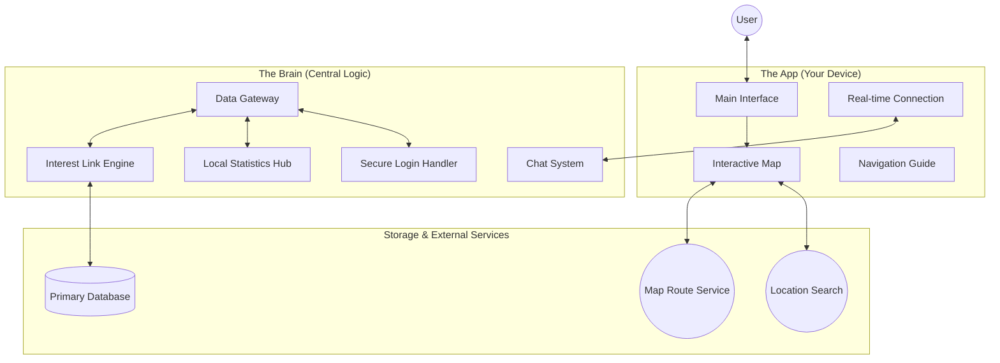
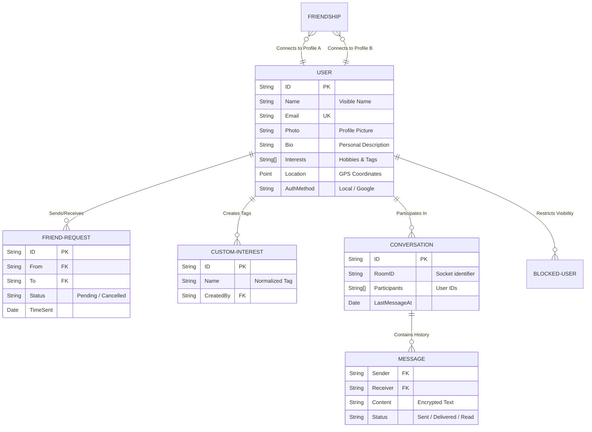
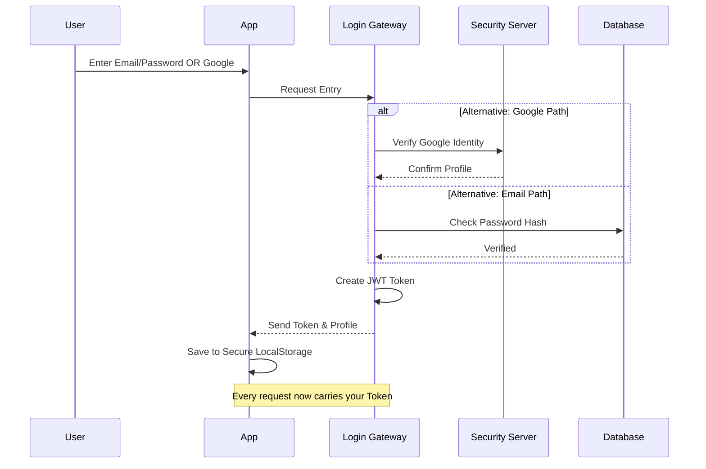
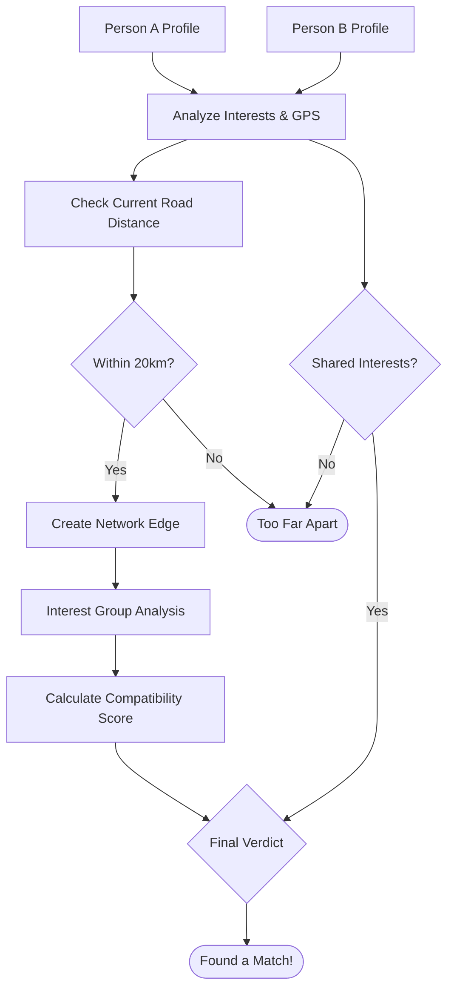
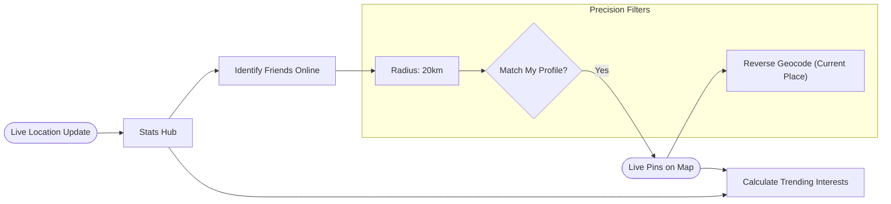
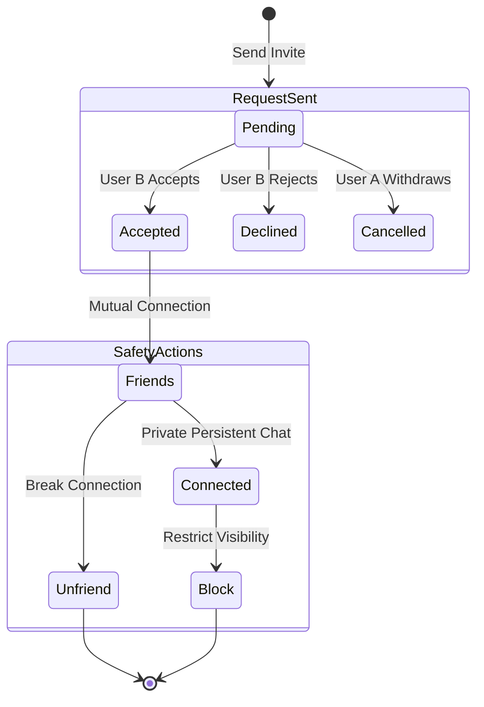
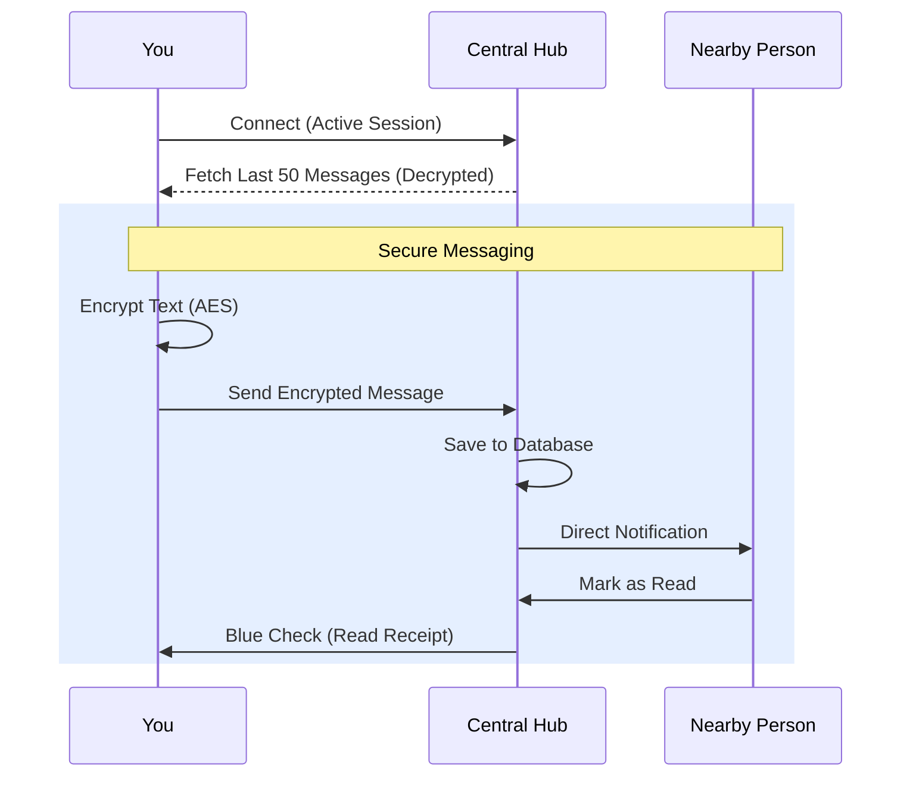
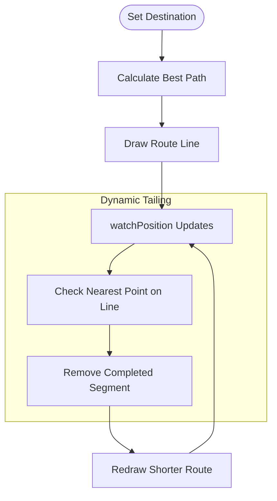
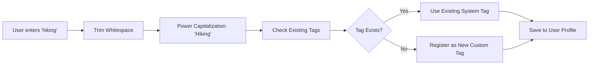

# KON-NECT: Project Architecture & System Diagrams

This document provides a comprehensive visual breakdown of how the KON-NECT application works, explaining the logic for everyone in a simple way.

---

## 🏗️ 1. How the System Works
This map shows how the App, the Brain (Back-end), and the Data interact to provide a seamless experience.

---

## 💾 2. Information Structure
This shows how users, friends, conversations, and interests are organized.

---

## 🔐 3. Secure Login Process
How you sign in securely via Email or Google.

---

## 🧠 4. Compatibility Logic
The intelligence that determines if two people are a good match.

---

## 🔍 5. People Discovery & Stats
How the app finds people and local trends around you.

---

## 🤝 6. Connection & Trust Lifecycle
Managing requests, friendships, and blocking safely.

---

## 💬 7. Persistent Encrypted Chat
How messages flow and stay securely stored in the system.

---

## 🗺️ 8. Navigation & Route Tailing
How the navigation guide follows you accurately on the map.

---

## 🏷️ 9. Interest Normalization
How we keep the library of interests clean and professional.

