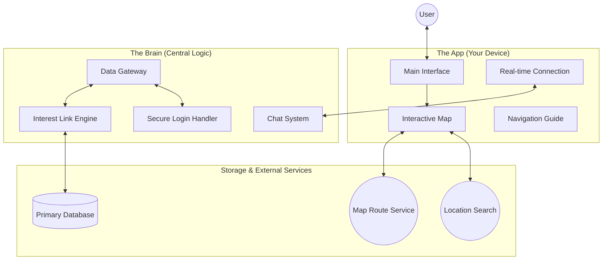
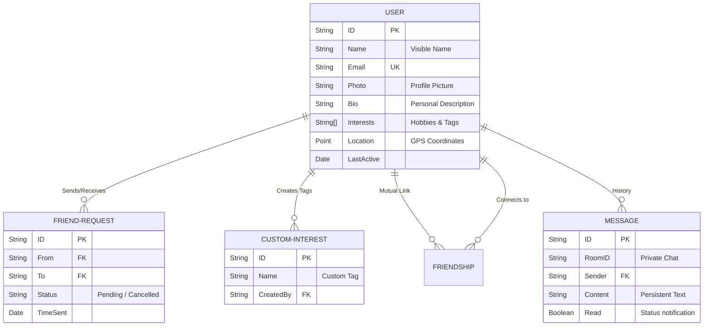
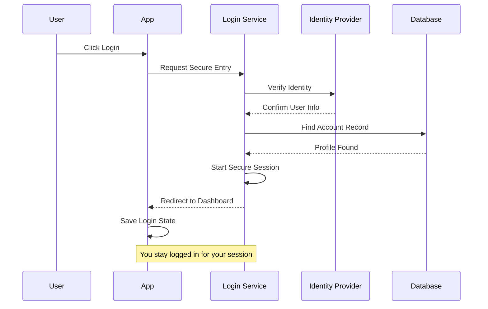
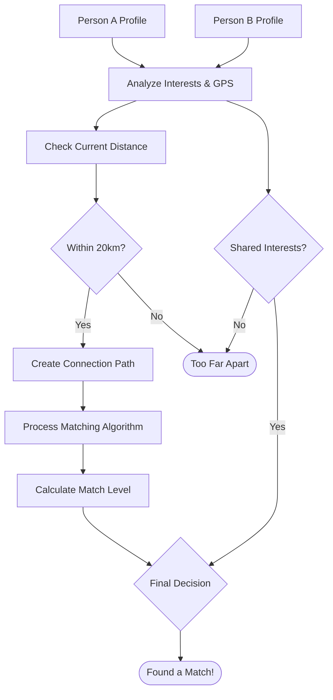
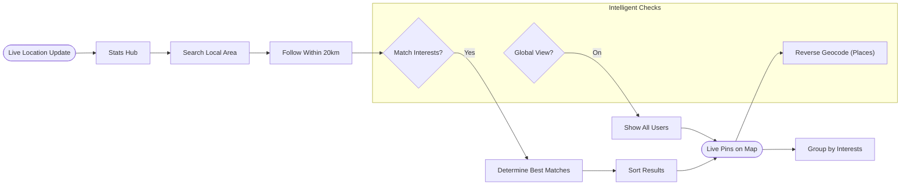
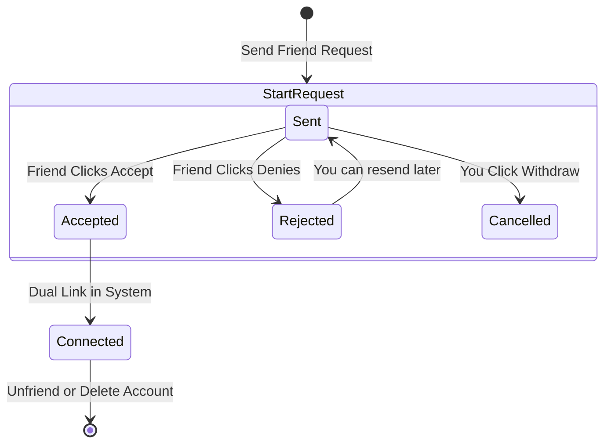
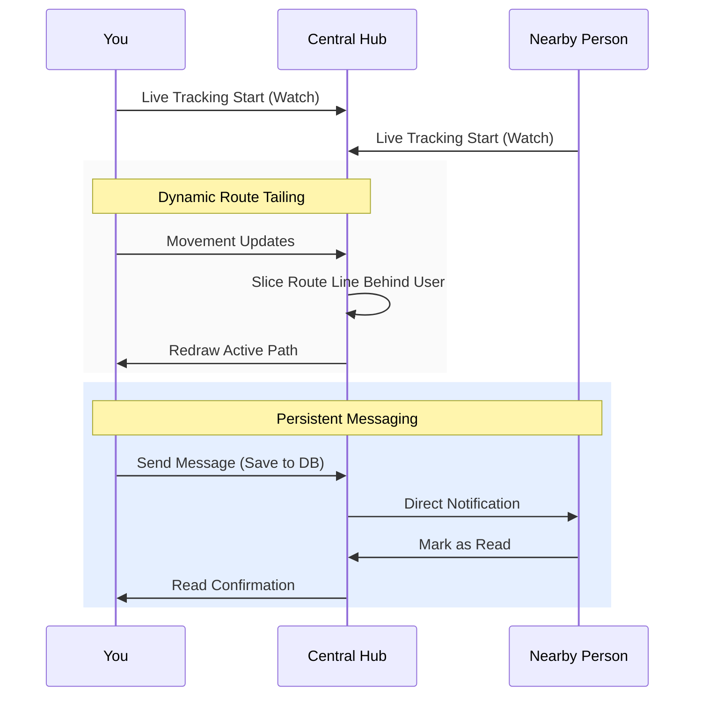
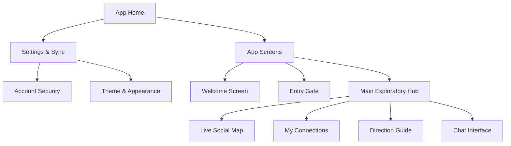

# KON-NECT: Project Architecture & System Diagrams

This document provides a comprehensive visual breakdown of how the KON-NECT application works, explaining the logic for everyone in a simple way.

---

## 🏗️ 1. How the System Works
This map shows how the App, the Brain (Back-end), and the Data interact to provide a seamless experience.

---

## 💾 2. Information Structure
This shows how users, friends, and interests are organized and connected.

---

## 🔐 3. Secure Login Process
A simple step-by-step guide on how you sign in securely.

---

## 🧠 4. Compatibility Logic
The intelligence that determines if two people are a good match.

---

## 🔍 5. People Discovery Flow
How the app finds and displays people around you.

---

## 🤝 6. Connecting with Friends
The workflow of managing your social connections.

---

## 💬 7. Instant Updates & Chat
How messages and location updates travel instantly while respecting privacy.

---

## 🗺️ 8. App Navigation Map
The simple structure of the app screens.

